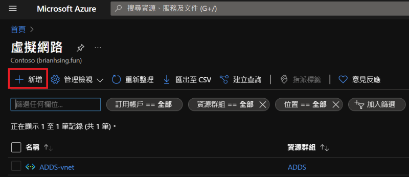
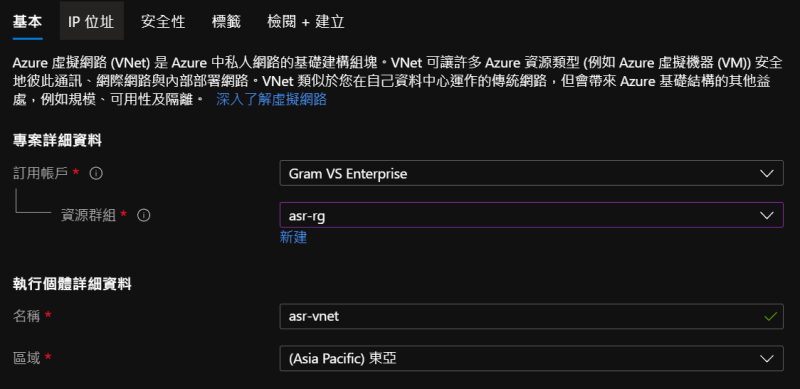
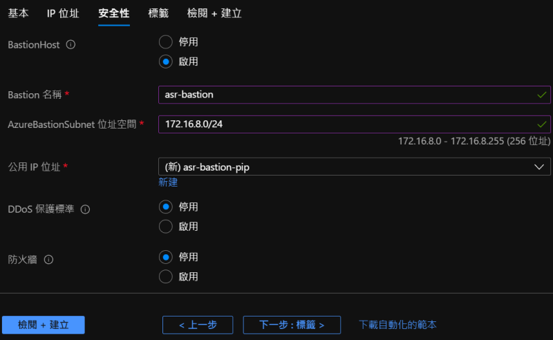
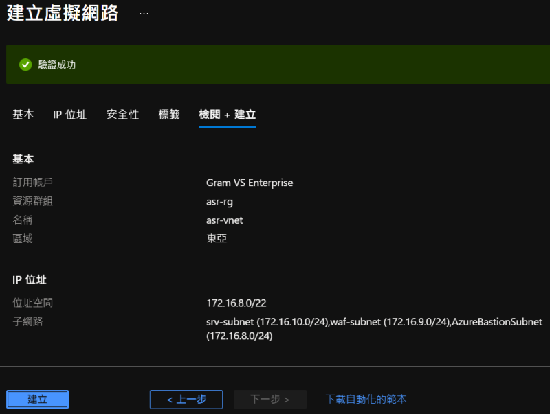
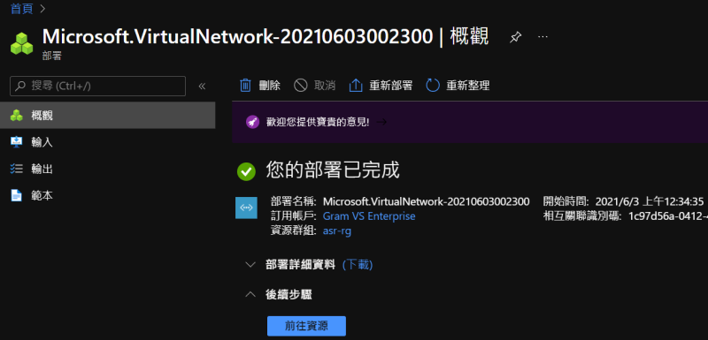

# Lab2 - 建立虛擬網路與堡壘機

- 從 Azure 入口網站上方搜尋欄輸入「虛擬網路」，請點選「虛擬網路」 
   
- 點選「新增」，建立新的虛擬網路 
   
-  選取您的「訂用帳戶」，選擇剛建立的資源群組「asr-rg」、輸入虛擬網路「名稱」，此範例使用 asr-vnet，並且選擇您想建立的「區域」，完成後點選「下一步」 
   
- 規劃您所需要的 IPv4 位置空間，此範例目標是把內部佈署環境移植上 Azure，並且整合其他網路服務，需要建立 3 個子網路，分別給予 VM (srv-subnet)、應用程式閘道 (waf-subnet)、堡壘機 (AzureBastionSubnet) 使用，還剩一個網段是預留給 Azure Firewall使用 (AzureFirewallSubnet)，您可以視需求建立，此演練步驟先不建立。其中堡壘機會在下一步建立。 
   
- 在「BastionHost」項目中點選啟用，輸入「Bastion 名稱」、「AzureBastionSubnet 位置空間」，建立新的「公用 IP 位址」。 
  > **Tips.子網路必須命名為 AzureBastionSubnet，子網路遮罩至少必須是 /27 或更大。**  
  
   
- 點選「建立」，等待建立完成 
   
- 看到下圖畫面代表您已完成 Lab2 
   

 前往 [Lab3 - 佈署適用於 VMware 的基礎結構](Lab3.md) 