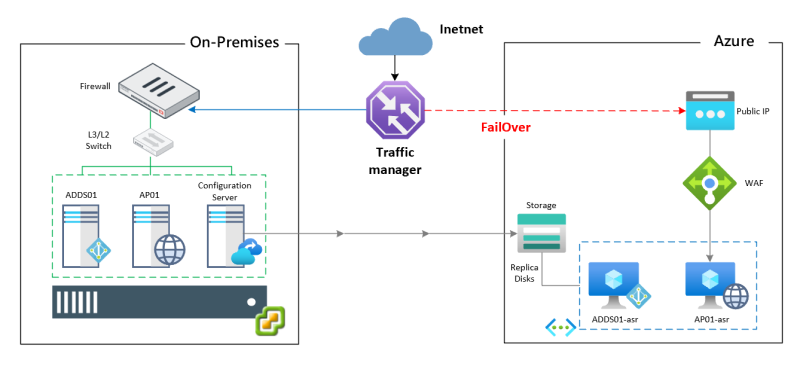

# VMware VM 災難復原至 Azure
本篇文章透過實際演練，教學如何將 Azure 災難備復原的解決方案實作在內部佈署 VMware VM 環境中，透過 Azure 服務流量管理員與應用程式閘道的配合，來降低災難復原的復原時間目標，並且保護對外服務網站。 
本篇文章實作時間大約需要花費 60 分鐘，完成後您將學會以下項目： 
- 建立復原保存庫，保存庫會保存 VMware VM 的中繼資料和組態資訊。 
- 建立虛擬網路，您必須考慮您容錯移轉後的網路環境，如果您需要同樣的網段分配、並且有設定靜態 IP，必須在這個步驟謹慎設定。 
- 設定適用於 VMware 的基礎結構，您必須分別輸入自動探索與能夠存取 VMware VM 的帳戶，並且將下載下來的 OVF 範本佈署 Configuration Servers，透過 Azure Site Recovery 設定精靈完成註冊。 
- 設定複寫，指定來源複寫目標，建立複寫原則，在這個步驟可以定義復原點的建立頻率、應用程式一致快照集的頻率與指定每個復原點的保留時間。 
- 執行災害復原演練，可驗證您複寫策略未遺失資料以及實際復原時間目標計算。 
- 設定流量管理員與應用程式閘道，透過流量管理員自動切換流量路由，並且透過應用程式閘道保護現有對外服務 
  
## 環境架構  

- 演練環境說明 
  - 模擬企業內部使用 VMware 虛擬化平台 (6.7 U3)，擁有兩台 VM，角色分別為網域控制站 (ADDS01) 與對外網頁服務 (AP01)，AP01 VM 有加入至網域控制站。 
  - 內部使用網段為 172.16.10.0/24。 
  - ADDS01 內部 IP 為 172.16.10.10。 
  - AP01 內部 IP 為 172.16.10.9，對外服務網址為 demo.brianhsing.fun/wordpress/。外部 IP 位址為 114.32.xxx.223 
     
  - VMware VM 均使用的 Windows Server 2016 Standard 評估版 
    https://www.microsoft.com/zh-tw/evalcenter/evaluate-windows-server-2016 
- 演練目標 
  - 在 VMware 虛擬化平台佈署 Configuration Servers，用來探索以及複寫需要災難復原的目標，進行災難復原演練，使用堡壘機服務管理虛擬機器並且設定好流量管理員與應用程式閘道，計算並且減少復原時間目標，確認對外服務確實被保護。 
## 演練流程  
- [Lab1 - 建立復原保存庫](Lab1.md) 
- [Lab2 - 建立虛擬網路與堡壘機](Lab2.md) 
- [Lab3 - 佈署適用於 VMware 的基礎結構](Lab3.md) 
- [Lab4 - 啟用複寫](Lab4.md) 
- [Lab5 - 執行災難復原演練](Lab5.md) 
- [Lab6 - 設定流量管理員與應用程式閘道](Lab6.md) 
- [Lab7 - 清除測試容錯移轉](Lab7.md) 

